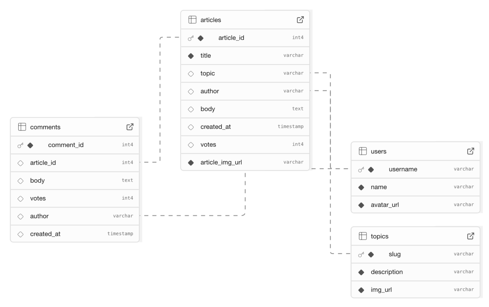

# DevDialogue API

## Hosted Version

[DevDialogue - Live Demo](https://nc-news-ya2m.onrender.com)

## Project Summary

Welcome to my first backend project 🎉DevDialogue!💬

DevDialogue represents my first dive into building a complete backend API from scratch.

This is a RESTful API that powers a website similar to Reddit where users can read news articles and join discussions. The API handles all backend functionality including article management, commenting, user infomation, and topic categorisation.

## Table of Contents

- [Setup Instructions](#setup-instructions)
- [Tech Stack & Skills](#tech-stack--skills)
- [API Documentation](#api-documentation)
- [Database Schema](#database-schema)

## Setup Instructions

### Prerequisites

- Node.js ( v23.7.0 or higher )
- PostgreSQL ( v14.0 or higher )

### Installation

#### 1. Clone the [repository](https://github.com/carlyzhong/DevDialogue-API):

#### 2. Install dependencies:

```zsh
npm install
```

#### 3. Set up environment variables:

Create two `.env` files in the root directory:

For development:

```
// .env.development
PGDATABASE=dev_dialogue
```

For testing:

```
// .env.test
PGDATABASE=dev_dialogue_test
```

#### 4. Set up and seed the database:

```zsh
npm run setup-dbs
npm run seed-dev
```

### Running Tests

Run the test suite with:

```zsh
npm test
```

### Local Development

To run the server locally:

```zsh
npm start
```

By default, the server will listen on port 9090 (`http://localhost:9090`).

## Tech Stack & Skills

This project demonstrates proficiency in API development, database design, Test-Driven Development, MVC architecture, error handling, and CI/CD implementation.

- **Node.js/Express.js**: RESTful API framework
- **PostgreSQL**: Relational database implementation
- **Jest/Supertest**: Automated testing suite
- **dotenv**: Environment configuration
- **Nodemon**: Development server
- **Husky**: Git hooks integration

### Skills

1. **Test-Driven Development**: Writing tests before implementing functionality. Tests cover:

- API endpoints
- Edge cases
- Error handling
- Data validation
- Database schema verification

2. **MVC Architecture**: Clear separation of models, views, and controllers
3. **RESTful Design**: Following REST principles for API endpoints
4. **Incremental Development**: Building features incrementally with git version control

## API Documentation

Once the server is running, you can access the API documentation at the `/api` endpoint, which provides details about all available endpoints, accepted queries, and example responses.

### Core Endpoints

| Method | Endpoint                           | Description                             |
| ------ | ---------------------------------- | --------------------------------------- |
| GET    | /api                               | API documentation                       |
| GET    | /api/topics                        | Get all topics                          |
| GET    | /api/articles                      | Get all articles (with filters/sorting) |
| GET    | /api/articles/:article_id          | Get specific article by ID              |
| GET    | /api/articles/:article_id/comments | Get comments for a specific article     |
| POST   | /api/articles/:article_id/comments | Post a new comment to an article        |
| PATCH  | /api/articles/:article_id          | Update article votes                    |
| DELETE | /api/comments/:comment_id          | Delete a comment                        |
| GET    | /api/users                         | Get all users                           |

### Query Examples

**Filtering articles by topic:**

```js
GET /api/articles?topic=coding
```

**Sorting articles:**

```js
GET /api/articles?sort_by=votes&order=DESC
```

**Full example with multiple parameters:**

```js
GET /api/articles?topic=coding&sort_by=created_at&order=ASC
```

For full details and example responses, check the `/api` endpoint.

## Database Schema


